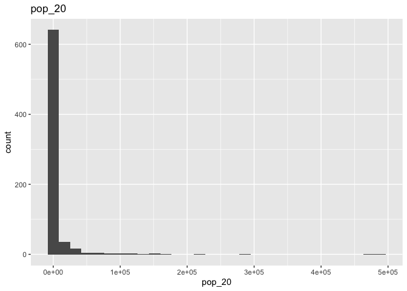
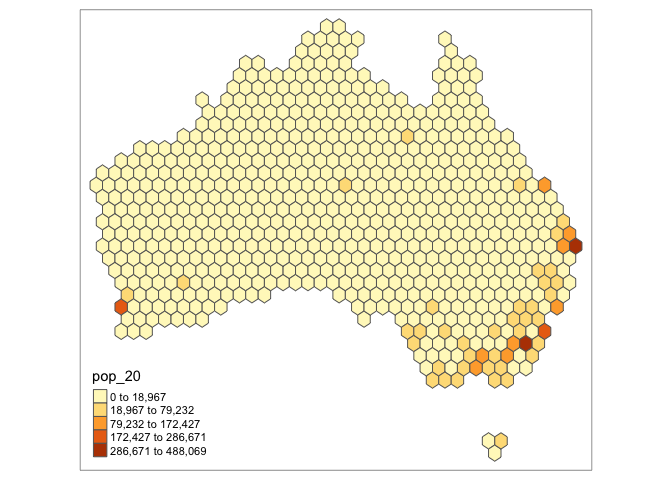

Geog6300: Lab 6
================

## Regression

``` r
library(sf)
library(tidyverse)
library(tmap)
library(lmtest)
library(car)
```

Name: Emma Benedict

**Overview:** This lab focuses on regression techniques. You’ll be
analyzing the association of various physical and climatological
characteristics in Australia with observations of several animals
recorded on the citizen science app iNaturalist.

\###Data and research questions###

Let’s import the dataset.

``` r
lab6_data<-st_read("data/aus_climate_inat.gpkg")
```

    ## Reading layer `aus_climate_inat' from data source 
    ##   `/Users/emmabenedict/Desktop/GEOG4300/Lab 6/data/aus_climate_inat.gpkg' 
    ##   using driver `GPKG'
    ## Simple feature collection with 716 features and 22 fields
    ## Geometry type: POLYGON
    ## Dimension:     XY
    ## Bounding box:  xmin: 113.875 ymin: -43.38632 xmax: 153.375 ymax: -11.92074
    ## Geodetic CRS:  WGS 84 (CRS84)

The dataset for this lab is a 1 decimal degree hexagon grid that has
aggregate statistics for a number of variables:

- ndvi: NDVI/vegetation index values from Landsat data (via Google Earth
  Engine). These values range from -1 to 1, with higher values
  indicating more vegetation.
- maxtemp_00/20_med: Median maximum temperature (C) in 2000 or 2020
  (data from SILO/Queensland government)
- mintemp_00/20_med: Median minimum temperature (C) in 2020 or 2020
  (data from SILO/Queensland government)
- rain_00/20_sum: Total rainfall (mm) in 2000 or 2020 (data from
  SILO/Queensland government)
- pop_00/20: Total population in 2000 or 2020 (data from NASA’s Gridded
  Population of the World)
- water_00/20_pct: Percentage of land covered by water at some point
  during the year in 2000 or 2020
- elev_med: Median elevation (meters) (data from the Shuttle Radar
  Topography Mission/NASA)

There are also observation counts from iNaturalist for several
distinctively Australian animal species: the central bearded dragon, the
common emu, the red kangaroo, the agile wallaby, the laughing
kookaburra, the wombat, the koala, and the platypus.

Our primary research question is how the climatological/physical
variables in our dataset are predictive of the NDVI value. We will build
models for 2020 as well as the change from 2000 to 2020. The second is
referred to as a “first difference” model and can sometimes be more
useful for identifying causal mechanisms.

\###Part 1: Analysis of 2020 data###

We will start by looking at data for 2020.

**Question 1** *Create histograms for NDVI, max temp., min temp., rain,
and population, and water in 2020 as well as elevation. Based on these
graphs, assess the normality of these variables.*

``` r
ggplot(lab6_data, aes(x=ndvi_20_med))+
  geom_histogram()+
  ggtitle("ndvi_20_med")
```

    ## `stat_bin()` using `bins = 30`. Pick better value with `binwidth`.

<!-- -->

``` r
ggplot(lab6_data, aes(x=maxtemp_20_med))+
  geom_histogram()+
  ggtitle("maxtemp_20_med")
```

    ## `stat_bin()` using `bins = 30`. Pick better value with `binwidth`.

<!-- -->

``` r
ggplot(lab6_data, aes(x=mintemp_20_med))+
  geom_histogram()+
  ggtitle("mintemp_20_med")
```

    ## `stat_bin()` using `bins = 30`. Pick better value with `binwidth`.

<!-- -->

``` r
ggplot(lab6_data, aes(x=rain_20_sum))+
  geom_histogram()+
  ggtitle("rain_20_sum")
```

    ## `stat_bin()` using `bins = 30`. Pick better value with `binwidth`.

<!-- -->

``` r
ggplot(lab6_data, aes(x=pop_20))+
  geom_histogram()+
  ggtitle("pop_20")
```

    ## `stat_bin()` using `bins = 30`. Pick better value with `binwidth`.

<!-- -->

``` r
ggplot(lab6_data, aes(x=water_20_pct))+
  geom_histogram()+
  ggtitle("water_20_pct")
```

    ## `stat_bin()` using `bins = 30`. Pick better value with `binwidth`.

<!-- -->

``` r
ggplot(lab6_data, aes(x=elev_med))+
  geom_histogram()+
  ggtitle("elev_med")
```

    ## `stat_bin()` using `bins = 30`. Pick better value with `binwidth`.

<!-- -->

{After looking at the histograms for each variable, I concluded that all
of the variables were not normal. I concluded this because each
histogram is either skewed to the left or the right. Firstly for the
ndvi_20_med is skewed to the right. This if followed by maxtemp_20_med
which is skewed to the left. Then mintemp_20_med which is less skewed
than the maxtemp but still seems to be skewed to the left. Next, the
rain_20_sum is very right skewed. This same pattern is seem in the
pop_20 variables which is also very right skewed. With the water_20_pct
we see that this is also very skewed to the right. Finally we have
elev_med which is less skewed than some variables but still skewed to
the right. Since all the variables have histograms that are skewed, I
concluded that they were all not normal.}

**Question 2** *Use tmap to map these same variables using Jenks natural
breaks as the classification method. For an extra challenge, use
`tmap_arrange` to plot all maps in a single figure.*

``` r
ndvi_20_med_plot <- tm_shape(lab6_data)+
  tm_polygons("ndvi_20_med", style = "jenks")
tm_shape(lab6_data)+
  tm_polygons("ndvi_20_med", style = "jenks")
```

<!-- -->

``` r
maxtemp_20_med_plot <- tm_shape(lab6_data)+
  tm_polygons("maxtemp_20_med", style = "jenks")
tm_shape(lab6_data)+
  tm_polygons("maxtemp_20_med", style = "jenks")
```

<!-- -->

``` r
mintemp_20_med_plot <- tm_shape(lab6_data)+
  tm_polygons("mintemp_20_med", style = "jenks")
tm_shape(lab6_data)+
  tm_polygons("mintemp_20_med", style = "jenks")
```

<!-- -->

``` r
rain_20_sum_plot <- tm_shape(lab6_data)+
  tm_polygons("rain_20_sum", style = "jenks")
tm_shape(lab6_data)+
  tm_polygons("rain_20_sum", style = "jenks")
```

<!-- -->

``` r
pop_20_plot <- tm_shape(lab6_data)+
  tm_polygons("pop_20", style = "jenks")
tm_shape(lab6_data)+
  tm_polygons("pop_20", style = "jenks")
```

<!-- -->

``` r
water_20_pct_plot <- tm_shape(lab6_data)+
  tm_polygons("water_20_pct", style = "jenks")
tm_shape(lab6_data)+
  tm_polygons("water_20_pct", style = "jenks")
```

<!-- -->

``` r
elev_med_plot <- tm_shape(lab6_data)+
  tm_polygons("elev_med", style = "jenks")
tm_shape(lab6_data)+
  tm_polygons("elev_med", style = "jenks")
```

    ## Variable(s) "elev_med" contains positive and negative values, so midpoint is set to 0. Set midpoint = NA to show the full spectrum of the color palette.

<!-- -->

``` r
#tmap_arrange(ndvi_20_med_plot,maxtemp_20_med_plot,mintemp_20_med_plot,rain_20_sum_plot,pop_20_plot,
             #water_20_pct_plot,elev_med_plot,nrow=4)
```

**Question 3** *Based on the maps from question 3, summarise major
patterns you see in the spatial distribution of these data from any of
your variables of interest. How do they appear to be associated with the
NDVI variable?*

{Starting with the max temp variable, the highest max temps are in
northern Australia and decresease as you move south and in wamer areas
up north there are a few cooler spots along the coast. Comparing this to
the NDVI, you see that it is higher in areas with a smaller max temp
which is predominately in the south. You can see a few higher NDVI
values are up north but they are clustered in the north along the coast
where there was sometimes a lower max temp. Next looking at the min
temp, the coldest temperatures are found in southern Australia and the
highest temperatures are found up north, similar to the max temp. In
this, we see that the NDVI is higher in the south where the colder
temperatures are with the few exceptions up north near the coast. Moving
onto rain, there is a larger association between rainfall and NDVI. With
the total rainfall, we see the highest amounts on the southeast coast
and northern coast. These areas of high precipitation overlap greatly
with high areas of NDVI that are mainly clustered in the south and
northern coast. You can also see that in the small island off the coast
of southern Australia as it has high amounts of total rainfall and the
NDVI values are also high there. Moving onto population, you see
clusters around the southeast coast which is where most major cities
are. These areas are also where there are higher NDVI values, but it
seems as though they aren’t as connected as the other variables are to
NDVI. Next we have water_20_pct which is land covered by water. There
doesn’t seem to be a huge patter here except for a small clustering of
larger percents of land covered by water in the central/south portion of
Australia. This does not seems to overlap with the NDVI values so there
does not seem to be a big correlation between the two. Lastly we have
elevation which is fairly spread out throughout Australia. You have some
high values along the southeastern coast and some in the central/west
area of Australia. Areas with a high elevation on the southeast coast
correspond to higher NDVI values.}

**Question 4** *Create univariate models for each of the variables
listed in question 1, with NDVI in 2020 as the dependent variable. Print
a summary of each model. Write a summary of those results that indicates
the direction, magnitude, and significance for each model coefficient.*

``` r
model_maxtemp<-lm(ndvi_20_med~maxtemp_20_med,data=lab6_data)
summary(model_maxtemp)
```

    ## 
    ## Call:
    ## lm(formula = ndvi_20_med ~ maxtemp_20_med, data = lab6_data)
    ## 
    ## Residuals:
    ##      Min       1Q   Median       3Q      Max 
    ## -0.41874 -0.07657 -0.01927  0.06833  0.36382 
    ## 
    ## Coefficients:
    ##                  Estimate Std. Error t value Pr(>|t|)    
    ## (Intercept)     0.6612389  0.0294372   22.46   <2e-16 ***
    ## maxtemp_20_med -0.0130902  0.0009601  -13.63   <2e-16 ***
    ## ---
    ## Signif. codes:  0 '***' 0.001 '**' 0.01 '*' 0.05 '.' 0.1 ' ' 1
    ## 
    ## Residual standard error: 0.1251 on 714 degrees of freedom
    ## Multiple R-squared:  0.2066, Adjusted R-squared:  0.2055 
    ## F-statistic: 185.9 on 1 and 714 DF,  p-value: < 2.2e-16

``` r
model_mintemp<-lm(ndvi_20_med~mintemp_20_med,data=lab6_data)
summary(model_mintemp)
```

    ## 
    ## Call:
    ## lm(formula = ndvi_20_med ~ mintemp_20_med, data = lab6_data)
    ## 
    ## Residuals:
    ##      Min       1Q   Median       3Q      Max 
    ## -0.36375 -0.08418 -0.03047  0.06972  0.40383 
    ## 
    ## Coefficients:
    ##                 Estimate Std. Error t value Pr(>|t|)    
    ## (Intercept)     0.464461   0.018997   24.45   <2e-16 ***
    ## mintemp_20_med -0.012282   0.001131  -10.86   <2e-16 ***
    ## ---
    ## Signif. codes:  0 '***' 0.001 '**' 0.01 '*' 0.05 '.' 0.1 ' ' 1
    ## 
    ## Residual standard error: 0.1301 on 714 degrees of freedom
    ## Multiple R-squared:  0.1418, Adjusted R-squared:  0.1406 
    ## F-statistic:   118 on 1 and 714 DF,  p-value: < 2.2e-16

``` r
model_rain<-lm(ndvi_20_med~rain_20_sum,data=lab6_data)
summary(model_rain)
```

    ## 
    ## Call:
    ## lm(formula = ndvi_20_med ~ rain_20_sum, data = lab6_data)
    ## 
    ## Residuals:
    ##      Min       1Q   Median       3Q      Max 
    ## -0.56681 -0.04753 -0.01210  0.04599  0.30930 
    ## 
    ## Coefficients:
    ##              Estimate Std. Error t value Pr(>|t|)    
    ## (Intercept) 1.303e-01  7.060e-03   18.45   <2e-16 ***
    ## rain_20_sum 9.124e-07  3.953e-08   23.08   <2e-16 ***
    ## ---
    ## Signif. codes:  0 '***' 0.001 '**' 0.01 '*' 0.05 '.' 0.1 ' ' 1
    ## 
    ## Residual standard error: 0.1063 on 714 degrees of freedom
    ## Multiple R-squared:  0.4273, Adjusted R-squared:  0.4265 
    ## F-statistic: 532.6 on 1 and 714 DF,  p-value: < 2.2e-16

``` r
model_pop<-lm(ndvi_20_med~pop_20,data=lab6_data)
summary(model_pop)
```

    ## 
    ## Call:
    ## lm(formula = ndvi_20_med ~ pop_20, data = lab6_data)
    ## 
    ## Residuals:
    ##      Min       1Q   Median       3Q      Max 
    ## -0.47003 -0.07883 -0.03949  0.06384  0.48974 
    ## 
    ## Coefficients:
    ##              Estimate Std. Error t value Pr(>|t|)    
    ## (Intercept) 2.552e-01  5.013e-03  50.902   <2e-16 ***
    ## pop_20      1.500e-06  1.500e-07   9.998   <2e-16 ***
    ## ---
    ## Signif. codes:  0 '***' 0.001 '**' 0.01 '*' 0.05 '.' 0.1 ' ' 1
    ## 
    ## Residual standard error: 0.1316 on 714 degrees of freedom
    ## Multiple R-squared:  0.1228, Adjusted R-squared:  0.1216 
    ## F-statistic: 99.97 on 1 and 714 DF,  p-value: < 2.2e-16

``` r
model_water<-lm(ndvi_20_med~water_20_pct,data=lab6_data)
summary(model_water)
```

    ## 
    ## Call:
    ## lm(formula = ndvi_20_med ~ water_20_pct, data = lab6_data)
    ## 
    ## Residuals:
    ##      Min       1Q   Median       3Q      Max 
    ## -0.26898 -0.08838 -0.04838  0.06871  0.50911 
    ## 
    ## Coefficients:
    ##               Estimate Std. Error t value Pr(>|t|)    
    ## (Intercept)   0.268988   0.006287  42.781   <2e-16 ***
    ## water_20_pct -0.178263   0.154480  -1.154    0.249    
    ## ---
    ## Signif. codes:  0 '***' 0.001 '**' 0.01 '*' 0.05 '.' 0.1 ' ' 1
    ## 
    ## Residual standard error: 0.1403 on 714 degrees of freedom
    ## Multiple R-squared:  0.001862,   Adjusted R-squared:  0.0004636 
    ## F-statistic: 1.332 on 1 and 714 DF,  p-value: 0.2489

``` r
model_elev<-lm(ndvi_20_med~elev_med,data=lab6_data)
summary(model_elev)
```

    ## 
    ## Call:
    ## lm(formula = ndvi_20_med ~ elev_med, data = lab6_data)
    ## 
    ## Residuals:
    ##      Min       1Q   Median       3Q      Max 
    ## -0.27082 -0.09585 -0.04270  0.07954  0.44272 
    ## 
    ## Coefficients:
    ##              Estimate Std. Error t value Pr(>|t|)    
    ## (Intercept) 2.138e-01  9.741e-03  21.952  < 2e-16 ***
    ## elev_med    1.787e-04  2.895e-05   6.171 1.14e-09 ***
    ## ---
    ## Signif. codes:  0 '***' 0.001 '**' 0.01 '*' 0.05 '.' 0.1 ' ' 1
    ## 
    ## Residual standard error: 0.1369 on 714 degrees of freedom
    ## Multiple R-squared:  0.05064,    Adjusted R-squared:  0.04931 
    ## F-statistic: 38.08 on 1 and 714 DF,  p-value: 1.136e-09

{Max Temp: For the maxtemp_20_med, it had a model coefficient of
-0.0131. This coefficient is negative which means there is a negative
correlation between the maxtemp and the amount of vegetation. With this,
that means that as the maxtemp (independent variable) increases, the
amount of vegetation (dependent variable) decreases. Looking at the
magnitude we can determine how much NDVI decreases as maxtemp increases
by 1. Since the coefficient is -0.0131 that means that for every 1
degree increase in the max temp, the NDVI will decrease by 0.0131.
Finally, if we look at the significance for this variable, there are
three stars next to it meaning it is very significant. There is a
p-value of 2e-16 which is much smaller than 0.05 and because of this we
can conclude that it is very significant Because of this we can conclude
that there is a significant relationship between max temp and NDVI.

Min Temp: For the mintemp_20_med, it had a model coefficient of -0.0123.
This coefficient is negative which means there is a negative correlation
between the mintemp and the amount of vegetation. With this, that means
that as the mintemp (independent variable) increases (increases as in
the min temp is warmer), the amount of vegetation (dependent variable)
decreases. Looking at the magnitude we can determine how much NDVI
decreases as min temp increases by 1. Since the coefficient is -0.0123
that means that for every 1 degree increase in the min temp, the NDVI
will decrease by -0.0123. Finally, if we look at the significance for
this variable, there are three stars next to it meaning it is very
significant. There is a p-value of 2e-16 which is much smaller than 0.05
and because of this we can conclude that it is very significant. Because
of this we can conclude that there is a significant relationship between
min temp and NDVI.

Rain: For the rain_20_sum, it had a model coefficient of 9.124e-07. This
coefficient is positive which means there is a positive correlation
between the total rain and the amount of vegetation. With this, that
means that as the total rain (independent variable) increases, the
amount of vegetation (dependent variable) also increases. Looking at the
magnitude we can determine how much NDVI increases as total rainfall
increases by 1. Since the coefficient is 9.124e-07 that means that for
every 1 mm increase in the total rainfall, the NDVI will increase by
9.124e-07. Finally, if we look at the significance for this variable,
there are three stars next to it meaning it is very significant. There
is a p-value of 2e-16 which is much smaller than 0.05 and because of
this we can conclude that it is very significant. Because of this we can
conclude that there is a significant relationship between rain total and
NDVI.

Population: For the pop_20, it had a model coefficient of 1.500e-06 .
This coefficient is positive which means there is a positive correlation
between the population and the amount of vegetation. With this, that
means that as the population (independent variable) increases, the
amount of vegetation (dependent variable) also increases. Looking at the
magnitude we can determine how much NDVI increases as population
increases by 1. Since the coefficient is 1.500e-06 that means that for
every 1 person increase in the population, the NDVI will increase by
1.500e-06 . Finally, if we look at the significance for this variable,
there are three stars next to it meaning it is very significant. There
is a p-value of 2e-16 which is much smaller than 0.05 and because of
this we can conclude that it is very significant. Because of this we can
conclude that there is a significant relationship between population and
NDVI.

Water: For the water_20_pct, it had a model coefficient of -0.178263 .
This coefficient is negative which means there is a negative correlation
between the percent of land covered by water and the amount of
vegetation. With this, that means that as the percent of land covered by
water (independent variable) increases, the amount of vegetation
(dependent variable) decreases. Looking at the magnitude we can
determine how much NDVI decreases as the percent of land covered by
water increases by 1. Since the coefficient is -0.178263 that means that
for every 1 percent increase in the amount of land covered by water, the
NDVI will decrease by -0.178263 . Finally, if we look at the
significance for this variable, there are no stars next to it meaning it
is not significant. There is a p-value of 0.249 which is bigger than
0.05 and because of this we can conclude that it is not significant.
Because of this we can conclude that there is not a significant
relationship between percent of land covered by water and NDVI.

Elevation: For the elev_med, it had a model coefficient of 1.787e-04 .
This coefficient is positive which means their is a positive correlation
between the elevation and the amount of vegetation. With this, that
means that as the elevation (independent variable) increases, the amount
of vegetation (dependent variable) also increases. Looking at the
magnitude we can determine how much NDVI increases as elevation
increases by 1. Since the coefficient is 1.787e-04 that means that for
every 1 meter increase in the elevation, the NDVI will increase by
1.787e-04 . Finally, if we look at the significance for this variable,
there are three stars next to it meaning it is very significant. There
is a p-value of 2e-16 which is much smaller than 0.05 and because of
this we can conclude that it is very significant. Because of this we can
conclude that there is a significant relationship between elevation and
NDVI.}

**Question 5** *Create a multivariate regression model with the
variables of interest, choosing EITHER max or min temperature (but not
both) You may also choose to leave out any variables that were
insignificant in Q4. Use the univariate models as your guide. Call the
results.*

``` r
model_multi<-lm(ndvi_20_med~maxtemp_20_med+rain_20_sum+pop_20+elev_med, data=lab6_data)
summary(model_multi)
```

    ## 
    ## Call:
    ## lm(formula = ndvi_20_med ~ maxtemp_20_med + rain_20_sum + pop_20 + 
    ##     elev_med, data = lab6_data)
    ## 
    ## Residuals:
    ##      Min       1Q   Median       3Q      Max 
    ## -0.50217 -0.02838  0.00409  0.03919  0.20570 
    ## 
    ## Coefficients:
    ##                  Estimate Std. Error t value Pr(>|t|)    
    ## (Intercept)     4.571e-01  2.194e-02  20.828  < 2e-16 ***
    ## maxtemp_20_med -1.170e-02  6.796e-04 -17.220  < 2e-16 ***
    ## rain_20_sum     8.469e-07  3.263e-08  25.953  < 2e-16 ***
    ## pop_20          2.862e-07  1.044e-07   2.741  0.00627 ** 
    ## elev_med        1.233e-04  1.796e-05   6.864 1.46e-11 ***
    ## ---
    ## Signif. codes:  0 '***' 0.001 '**' 0.01 '*' 0.05 '.' 0.1 ' ' 1
    ## 
    ## Residual standard error: 0.0845 on 711 degrees of freedom
    ## Multiple R-squared:  0.6397, Adjusted R-squared:  0.6376 
    ## F-statistic: 315.5 on 4 and 711 DF,  p-value: < 2.2e-16

``` r
# I chose to do max temp instead of min temp and I left out water_20_pct because it was insignificant in the univariate model.
```

**Question 6** *Summarize the results of the multivariate model. What
are the direction, magnitude, and significance of each coefficient? How
did it change from the univariate models you created in Q4 (if at all)?
What do the R2 and F-statistic values tell you about overall model fit?*

{Max Temp: The coefficient is negative, has a magnitude of 1.170e-02,
and it is very significant (p-value \< 0.05, 3 stars). The only thing
that changed in this model compared to the univariate model is the
magnitude of the coefficient which was 0.0131. So both the direction and
the significance stayed the same.

Rain: The coefficient is positive, has a magnitude of 8.469e-07, and it
is very significant (p-value \< 0.05, 3 stars). The only thing that
changed in this model compared to the univariate model is the magnitude
of the coefficient which was 9.124e-7. So both the direction and the
significance stayed the same.

Population: The coefficient is positive, has a magnitude of 2.862e-07,
and it is significant (p-value \< 0.05, 2 stars). In this case both the
magnitude and the significance changed in this model compared to the
univariate model. In the univariate model the magnitude was 1.500e-06
and it had three stars for the significance instead of two like the
multivariate model (so still significant just slightly less). So the
direction stayed the same.

Elevation: The coefficient is positive, has a magnitude of 1.233e-04,
and it is very significant (p-value \< 0.05, 3 stars). The only thing
that changed in this model compared to the univariate model is the
magnitude of the coefficient which was 1.787e-04. So both the direction
and the significance stayed the same.

In this model the R-squared value is 0.6397 which is relatively high.
This means that about 64% of variance in the NDVI variable can be
explained by the other variables. The F-statistic is 315.5 which is
relatively high. This means that the differences between the variables
are most likely statistically significant. Since the R-squared value and
F-statistic are both relatively high, the model have a fairly good
overall fit.}

**Question 7** *Use a histogram and a map to assess the normality of
residuals and any spatial autocorrelation. Summarise any notable
patterns that you see.*

``` r
lab6_data$residuals<-residuals(model_multi)

ggplot(lab6_data, aes(x=residuals))+
  geom_histogram()+
  ggtitle("Residuals")
```

    ## `stat_bin()` using `bins = 30`. Pick better value with `binwidth`.

<!-- -->

``` r
tm_shape(lab6_data)+
  tm_polygons("residuals", style = "jenks")
```

    ## Variable(s) "residuals" contains positive and negative values, so midpoint is set to 0. Set midpoint = NA to show the full spectrum of the color palette.

<!-- -->

{Looking at a histogram and map, I concluded that the variables are not
normal. Firstly, the histogram shows the residuals beings skewed to the
left indication the residuals are not normal. Second if we look at the
variables on the map, we see an uneven distribution with there being a
cluster of negative residuals in the center of Australia. In addition to
this, the highly negative residuals are all mostly located on the coast
of Australia. Due to this and the histogram, I would say the residuals
are not normal.}

**Question 8** *Assess any issues with multicollinearity or
heteroskedastity in this model using the techniques shown in class. Run
the appropriate tests and explain what their results show you.*

``` r
#Multicollinearity
vif(model_multi)
```

    ## maxtemp_20_med    rain_20_sum         pop_20       elev_med 
    ##       1.098705       1.078449       1.173863       1.009305

``` r
#Heteroskedastity
bptest(model_multi)
```

    ## 
    ##  studentized Breusch-Pagan test
    ## 
    ## data:  model_multi
    ## BP = 122.21, df = 4, p-value < 2.2e-16

{Mulitcollinearity is when there is a correlation between two
independent variables. If this happens it can lead to a
misinterpretation of results. For this model all, the vif() test
produces values that are all around 1 for each variable. Since these
values are all around 1 we can conclude that multicollinearity is not a
problem in this model. For the bptest to look for heteroskedastity, you
get a p-value of 2.2e-16 which is much smaller than 0.05. As a result,
we reject the null hypothesis that the data is not heteroskedastic.
Because of this we conclude that the data is heteroskedastic which means
it has a funnel-like shape on a graph which indicates the residuals
spread out as you move along the x-axis.}

**Question 9** *How would you summarise the results of this model in a
sentence or two? In addition, looking at the full model and your
diagnostics, do you feel this is a model that provides meaningful
results? Explain your answer.*

{This model shows that the range of NDVI values in Australia can be
explained by the variables of interest: Max Temp, Rain Total,
Population, and Elevation. Looking at the model and its associated
values, I believe this model provides meaningful results. First, all of
the variables included in the model (Max Temp, Rain Total, Population,
and Elevation) are all statistically significant (have p-values \<
0.05). In addition to this, there is a relatively high R-squared value
of 0.6397 which indicates that around 64% of the variance observed in
the NDVI values is explained by the variables on interest. Finally, the
model has a high F-statistic of 315.5. This value indicates that the
difference between the variables is statistically significant
(F-statistic has a p-value \< 0.05) and not due to random chance.
Because of these things, I concluded that the model does provide
meaningful results.}

**Disclosure of assistance:** *Besides class materials, what other
sources of assistance did you use while completing this lab? These can
include input from classmates, relevant material identified through web
searches (e.g., Stack Overflow), or assistance from ChatGPT or other AI
tools. How did these sources support your own learning in completing
this lab?*

{For this lab, I was able to complete it by using the in-class scripts.
I also received help for Dr. Shannon during our lab work day.}

**Lab reflection:** *How do you feel about the work you did on this lab?
Was it easy, moderate, or hard? What were the biggest things you learned
by completing it?*

{I thought this lab was moderate. I feel like in class some of the model
stuff was not clicking super well, but by working through this lab I
have a much better understanding of univariate and multivariate models.}

**Challenge question**

\#Option 1 Create a first difference model. To do that, subtract the
values in 2000 from the values in 2020 for each variable for which that
is appropriate. Then create a new model similar to the one you created
in question 5, but using these new variables showing the *change in
values* over time. Call the results of the model, and interpret the
results in the same ways you did above. Also chart and map the residuals
to assess model error. Finally, write a short section that summarises
what, if anything, this model tells you.

\#Option 2 The animal data included in this dataset is an example of
count data, and usually we would use a Poisson or similar model for that
purpose. Let’s try it with regular OLS regression though. Create two
regression models to assess how the counts of two different animals
(say, koalas and emus) are associated with at least three of the
environmental/climatological variables given above. Be sure to use the
same independent variables in each model. Interpret the results of each
model and then explain the importance of any differences in the model
coefficients between them, focusing on direction, magnitude, and
significance.
